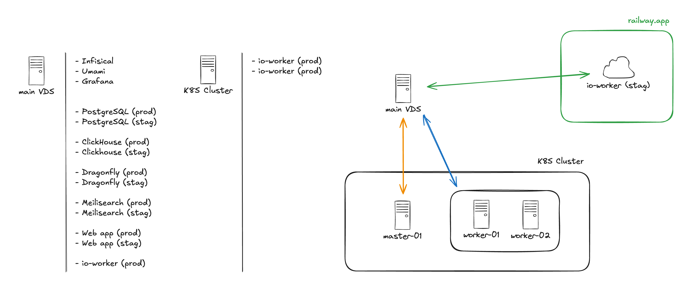

# Infrastructure

This repository is mainly edited using GitBook's GitHub integration and sync feature. This describes our current infrastructure and provides some automation scripts for server onboarding.

### Overview

<figure><figcaption>
Infrastructure overview
</figcaption></figure>

### To-do

* [ ] Add K8S Cluster instructions
* [ ] Add Infisical service description
* [ ] Add Grafana service description and dashboards used
* [ ] Add Umami service description

