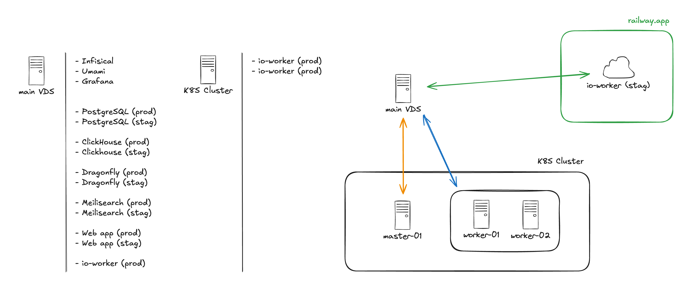

# Infrastructure

This repository describes our current infrastructure situation and provides some automation scripts for various tasks.

## Overview

## Objectives

There are a few things we want to achieve with our infrastructure. Some are short-term and some long-term.

### Split staging and production

From the overview above, we can see that the main VDS is hosting both production and staging environments. This is not good as we want production to run as smoothly as possible. Staging is not used for anything other than some testing now and then. It doesn't need to be as stable as production.

There are 2 solutions to this problem:

1. Buy another server and move staging there
2. Move staging to some cloud provider

The main factor that'll decide which solution is better is the cost. Maybe moving everything to Railway, which is a cloud provier we're already using, is cheaper than buying another server.

### Use Kubernetes

We already have a cluster up and running with 2 instances of `io-worker`. As the website grows, it'll be better to use Kubernetes to scale our services.

## To-do

This document is far from complete. Here is a list of things that need to be done:

- [ ] Add K8S Cluster instructions
- [ ] Add Infisical service description
- [ ] Add Grafana service description and dashboards used
- [ ] Add Umami service description
